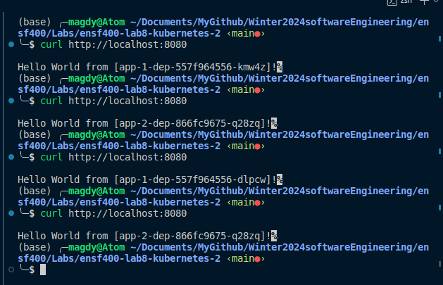
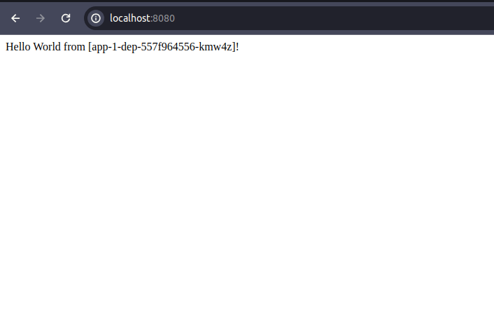

# ENSF 400 - Assignment 3 - Kubernetes Deployment Guide

This guide provides step-by-step instructions for deploying an Nginx service as a load balancer and two backend applications within a Minikube environment.

## Prerequisites

Before you begin, ensure you have the following installed:

- Minikube
- kubectl
- Docker (optional, for building images if not using pre-built ones)

## Deployment Process

### Step 1: Start Minikube

Start your Minikube cluster:

```sh
minikube start
```

### Step 2: Deploy the code
run 
```sh
kubectl apply -f assignment3/
``` 
where assignment3 is the root folder, this command will apply all the yaml files to kubernetes

### Step 3: Verify Deployment

Ensure all components are correctly deployed and accessible.

- Check the status of the deployments:

```sh
kubectl get deployments
```

- Ensure the services are running:

```sh
kubectl get services
```

- Check the ingress setup:

```sh
kubectl get ingress
```

### Step 4: Accessing the Application

You would have to forward port 8080 to 80 so run command:
```sh
 kubectl port-forward svc/nginx-svc 8080:80
 ```
then in another terminal run 
```sh
curl http://localhost:8080
```
You should get something like this:
 
 

or use browser and enter http://localhost:8080 and you should get something like this :

 
 
and if you refresh it should switch between app1 and app2

## Troubleshooting

- If any service or deployment does not appear to be running correctly, check the logs for more information:

```sh
kubectl logs <pod-name>
```

