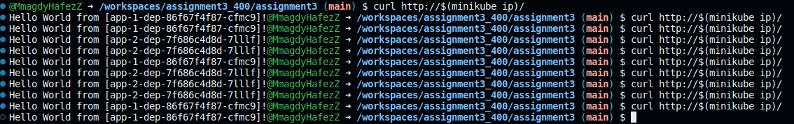
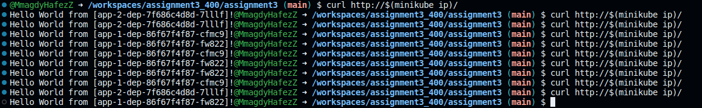

# ENSF 400 - Assignment 3 - Kubernetes Deployment Guide

This comprehensive guide walks you through deploying an Nginx service as a load balancer, along with two backend applications, within a Minikube environment. Follow these steps to ensure a successful deployment.

## Prerequisites

Ensure you have the following tools installed on your system before starting the deployment process:

- **Minikube**: An easy-to-use tool for running Kubernetes locally. It runs a single-node Kubernetes cluster on your personal computer (including Windows, macOS, and Linux PCs) so you can try out Kubernetes, or develop with it day-to-day.
- **kubectl**: A command-line tool that allows you to run commands against Kubernetes clusters. You will use it to deploy applications, inspect and manage cluster resources, and view logs.
- **Docker**: Optional. Required only if you're building your own container images instead of using pre-built ones.

## Deployment Process

### Step 1: Start Minikube

Initiate your Minikube cluster with the following command. This will create a virtualized Kubernetes node on your machine:

```sh
minikube start
```

**Note**: You can specify the Kubernetes version with `--kubernetes-version` flag, or the driver with `--driver=<driver_name>`.

Enable ingress addon by:
```sh
minikube addons enable ingress
```
then navigate to assignment3 folder 

```sh
cd assignment3
```
### Step 2: Deploy the Application Components

Navigate to the root directory where your Kubernetes YAML files are located (`assignment3/` in this context), and apply all configurations to your cluster:

```sh
kubectl apply -f nginx-configmap.yaml  -f app-1-svc.yaml -f app-2-svc.yaml -f nginx-svc.yaml -f app-1-dep.yaml -f app-2-dep.yaml -f nginx-dep.yaml
```

This step will create most of the required deployments and services resources based on the YAML definitions.

### Step 3: Verify Deployment

It’s crucial to ensure that all components have been deployed correctly and are in a healthy state.

- **Deployments**: Check the status and ensure all desired pods are up and running:

  ```sh
  kubectl get deployments
  ```

- **Services**: Verify that the services are active:

  ```sh
  kubectl get services
  ```

- **Ingress**: Ensure the ingress resources are set up properly:

  ```sh
  kubectl get ingress
  ```

### Step 4: Accessing the Applications

#### Load Balancer Verification

To confirm the Nginx load balancer functionality:

1. Apply the Nginx ingress configuration:
   
   ```sh
   kubectl apply -f nginx-ingress.yaml  
   ```
   do step 3 if in doubt

2. Use `curl` to request the Minikube IP:

   ```sh
   curl http://$(minikube ip)/
   ```

   This should distribute the load between `app-1` and `app-2`.



#### Canary Deployment Verification

For testing the 70:30 traffic split between `app-1` and `app-2`:

1. Remove the Nginx ingress to avoid conflicts:

   ```sh
   kubectl delete ingress nginx-ingress
   ```

2. Apply the ingress configurations for both applications:

   ```sh
   kubectl apply -f app-1-ingress.yaml -f app-2-ingress.yaml
   ```
    do step 3 if in doubt


3. Send multiple requests to the Minikube IP:

   ```sh
   curl http://$(minikube ip)/
   ```

   Ideally, you'll see approximately 70% of requests directed to `app-1` and 30% to `app-2`.




## Troubleshooting

Should you encounter any issues during deployment:

- Inspect the logs of a specific pod that seems to be misbehaving:

  ```sh
  kubectl logs <pod-name>
  ```

- If a deployment fails to start or a pod is stuck in `Pending` or `CrashLoopBackOff`, detailed pod descriptions can provide insights:

  ```sh
  kubectl describe pod <pod-name>
  ```

- Reviewing Minikube's logs can also help identify issues with the Minikube environment itself:

  ```sh
  minikube logs
  ```

**Additional Tips**:

- Use `minikube dashboard` for a GUI overview of your cluster's state.
- If problems persist, restarting Minikube or recreating your Kubernetes objects might be necessary. Sometimes, starting from a clean state resolves obscure issues.

